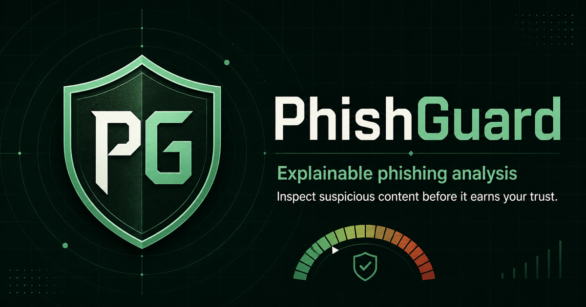

# AI Phishing Detection and Prevention System

An explainable phishing-risk analysis system for email content and URLs. The
project will combine machine-learning models with deterministic security rules
to identify suspicious messages, explain the warning signs, and recommend a
proportionate response.



> **Project status:** Phase 6 — responsive analysis dashboard connected to the
> secure email and URL API, verified model artifacts, calibrated explanations,
> and advisory actions. The models remain research baselines.

## Project goals

- Analyze pasted email content and standalone URLs without visiting links.
- Return a `legitimate`, `suspicious`, or `phishing` classification.
- Provide a calibrated risk score from 0 to 100.
- Explain the signals that influenced each result.
- Recommend whether to allow, warn, quarantine, or block.
- Demonstrate reproducible ML, secure API design, automated tests, and
  deployment practices in a portfolio-ready project.

## User experience

1. A user pastes an email or URL into the web interface.
2. The service safely parses the submitted content.
3. Rules and ML models evaluate text, sender, and URL characteristics.
4. The user receives a risk score, human-readable reasons, and a recommended
   action.
5. Optional feedback can be used to evaluate future model versions without
   storing sensitive email content by default.

## Initial detection coverage

- Credential-theft and account-takeover messages
- Sender and brand impersonation
- Deceptive, obfuscated, and suspicious URLs
- Urgency, fear, reward, and payment-based social engineering
- Requests for passwords, payment, or other sensitive information
- Suspicious attachment names and HTML form indicators

## Safety principles

- Submitted URLs are parsed as text and never automatically opened.
- Email HTML is treated as untrusted input and is never rendered directly.
- Raw private email content is not retained by default.
- A low risk score is not presented as proof that content is safe.
- Automated blocking will not be enabled until performance and false-positive
  behavior are evaluated.

## Architecture

```text
Web interface
      |
      v
FastAPI analysis service
      |
      +--> Safe email and URL parsing
      +--> Rule-based security signals
      +--> Email text model
      +--> URL feature model
      +--> Risk scoring and explanation engine
      |
      v
Classification + score + reasons + recommended action
```

## Documentation

- [Project scope](docs/project-scope.md)
- [Threat model](docs/threat-model.md)
- [Development guide](docs/development.md)
- [Data card](docs/data-card.md)
- [Latest data-quality report](docs/data-quality-report.md)
- [Model card](docs/model-card.md)
- [URL reputation and normalization](docs/url-reputation.md)
- [Baseline evaluation](docs/model-evaluation.md)
- [Explanation and prevention-policy evaluation](docs/explanations-and-policy.md)
- [API guide](docs/api.md)
- [Dashboard guide](docs/dashboard.md)

## Local development

### Requirements

- Python 3.12+
- Git
- Docker Desktop (optional)

### Run with Python

```bash
python3 -m venv .venv
source .venv/bin/activate
python -m pip install --upgrade pip
python -m pip install -e ".[dev]"
uvicorn phishguard.main:app --reload
```

Open `http://localhost:8000/` for the analysis dashboard, `/docs` for interactive
API documentation, or `/ready` to verify that the hashed model artifacts are
loaded. The data, model-training, and policy-build steps below must be run before
analysis is ready.

### Run the checks

```bash
ruff check .
ruff format --check .
mypy src tests
pytest
```

### Run with Docker

```bash
docker compose up --build
```

The API will be available at `http://localhost:8000`.

## Reproduce the dataset

Install the data-pipeline dependency, download the pinned source files, and
prepare the normalized splits:

```bash
python -m pip install -e ".[data]"
python scripts/download_data.py
python scripts/prepare_data.py
```

Downloaded source data and processed records remain outside Git. The source
manifest, attribution, checksums, data card, and aggregate quality report are
versioned in the repository. The pipeline never opens or visits URLs contained
inside the datasets.

## Train the baseline models

After reproducing the processed dataset, install the ML dependency and run:

```bash
python -m pip install -e ".[ml]"
python scripts/train_models.py
```

This trains separate email and URL classifiers, selects thresholds on validation
data, evaluates untouched test data, and writes model artifacts under the
Git-ignored `artifacts/` directory. Never load an untrusted model artifact.

## Build the explanation and prevention policy

After training the baseline models, build the validation-only sigmoid calibrators,
versioned advisory policy, explanation examples, and evaluation report:

```bash
python scripts/build_detection_policy.py
```

The generated policy maps calibrated risk scores to `allow`, `warn`, `quarantine`,
or `block` recommendations. For URL analysis, hostname and path/query text are
modeled separately so a brand name in an attacker's path is not confused with the
actual destination. A transparent exact-host safeguard based on pinned Tranco
top-domain data reduces false positives for popular HTTPS domains without trusting
lookalikes. Inputs without a scheme are analyzed as HTTPS and clearly disclosed.
These actions are advisory and are not enforced.

## Roadmap

- [x] Define project scope and threat model
- [x] Create the repository and development foundation
- [x] Build a reproducible data pipeline
- [x] Train and evaluate baseline email and URL models
- [x] Add calibration, explanations, and prevention policies
- [x] Expose the detector through a secure API
- [x] Build a responsive web dashboard
- [ ] Test, harden, package, and deploy the system
- [ ] Compare the baseline with an advanced transformer or ensemble

## Current limitations

This repository now provides a responsive dashboard and offline email and URL
prediction endpoints with bounded inputs, verified artifacts, calibrated risk
scoring, explanations, and an advisory response policy. Authentication,
distributed rate limiting, public hosting, and a live demo remain later phases.

## Responsible use

This project is intended for education, defensive security research, and
portfolio demonstration. It will not collect credentials, execute attachments,
visit submitted URLs, or claim to replace a layered email-security program.
